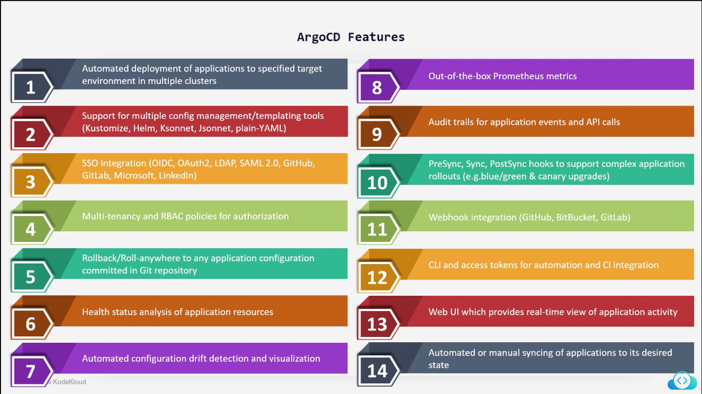

# ArgoCD Learning
<h4>Documenting my learning around ArgoCD, The "Summary Of Topics" below details all the topics covered in this repository.</h4>
 

 

<h3>
    
Continuiosly monitors applications live state with desired state and compares the code for changes 

<h2>ArgoCD concepts and termnioligy</h2>

Application - a group of kubernetes resources as defined by a manifest. 
Application Source Type - The tooil ios used to build the application.  
Project - provide a logical grouping of applications, which is useful when Argo CD is used by multiple teams. 
 
Target State - The desired state of an application,as represented by files in a Git repository. 
Live State - The liive shatw whatt pods,configmap, secrets, etc are created/deployed in a kubernetes cluster.
 
 
Sync Status - Whether or not the live state matches the target state. (is the deployed application the same as git says it should be?) 
Sync - The process of making an application move toi its target state.  
Sync operation status - Whether or not a sync succeeded
  
Refresh - Compare the latest code in github with the live state <>
Health - The health of the application
 
<h2>ArgoCD features</h2>

 