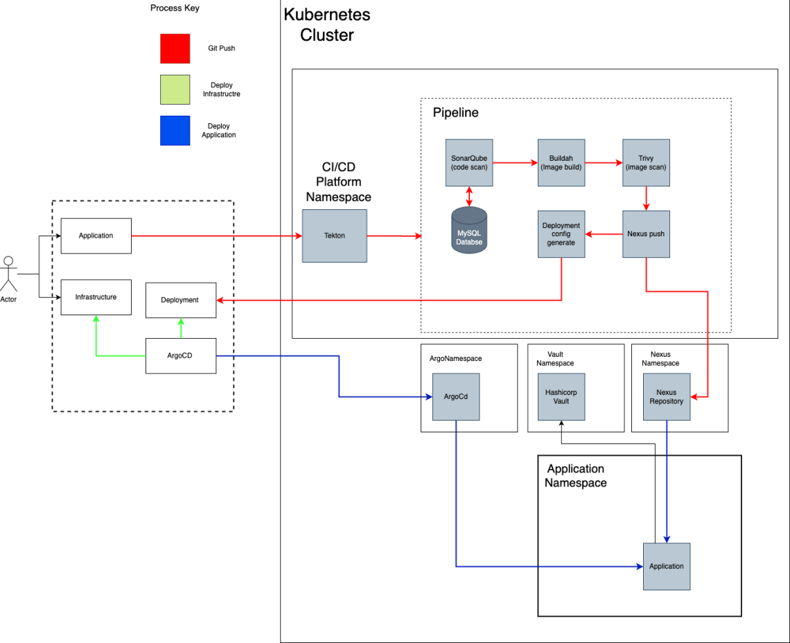

# Practice Project
<h4></h4>
 
<h2>Problem Statement</h2>
An organisation needs on demand CICD infrastructure and does not have the time/funds to up skill its own staff to create it themselves. Our solution is too create a helm chart for this organisation that they can use to spin up the needed architecture on demand. This architecture should include, a pipeline orchestrator, push detection, static code analysis, image analysis, secret storage, artefact storage,  and is deployed in kubernetes. Use ArgoCD
  
<h2>Solution</h2>

 
<h2>Steps</h2>
1. Download kubernetes  
2. Download tools (kubectl)  
3. Create a Namespace, application, CI/CD, argo, hashicorp using kubectl  
4. Create kubernetes cluster  
5. Pod definition file for each of the machines needed (Tekton, Buildah, Trivy, ArgoCd, SonarQube, Hashicorp Vault, Nexus Repository)  
6. Install argo CD  
7. Download ArgoCD CLI  
8. Change the argocd-server service type to LoadBalancer  
9. Login Using The CLI  
10. Go to https://artifacthub.io/packages/helm/hashicorp/vault and get a chart for vault, mssql and nexus
11. Register A Cluster To Deploy Apps  
12. Create your GO Application in A Git Repository  
13. Sync/Deploy The Application  

